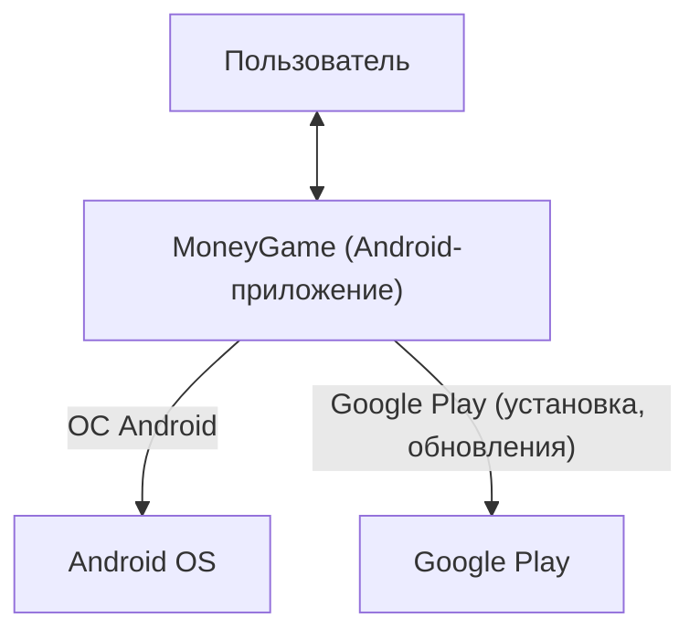
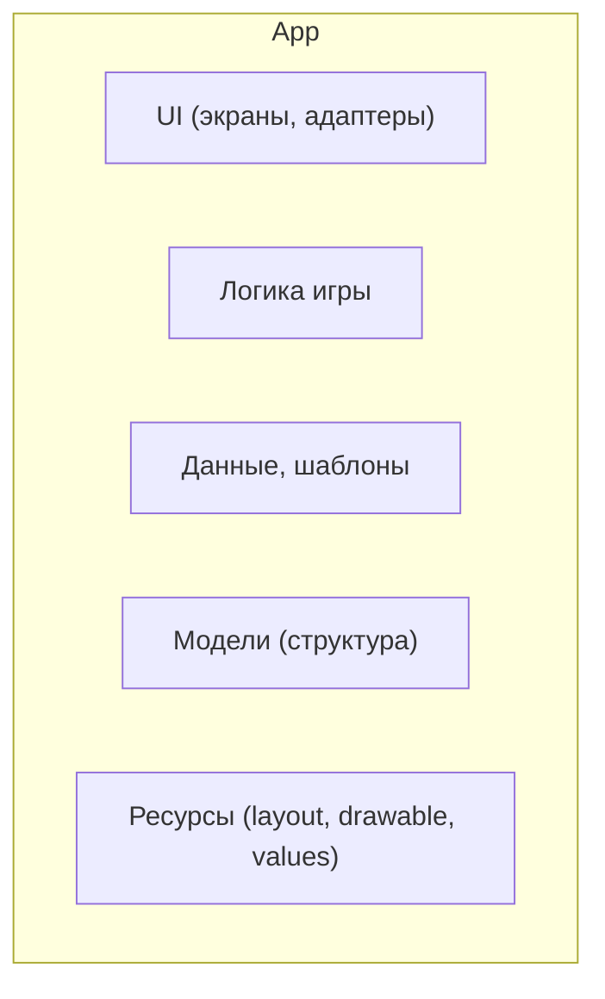
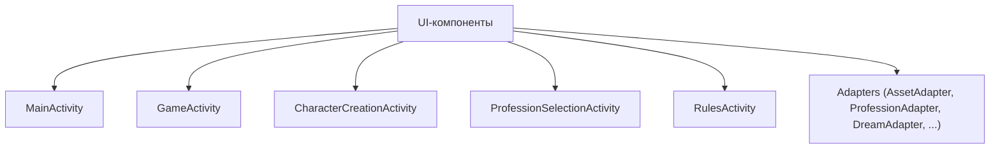
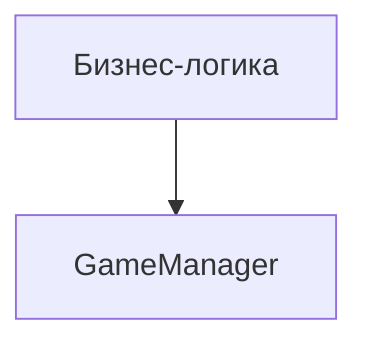
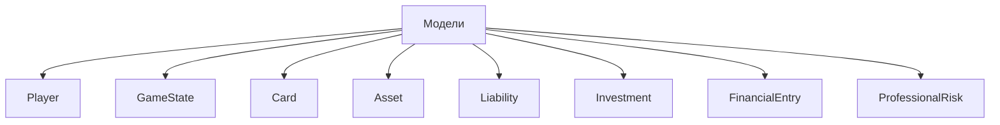
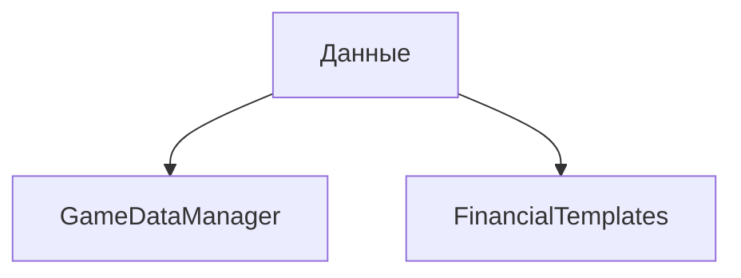
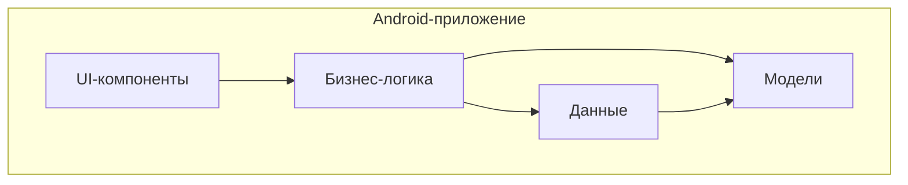
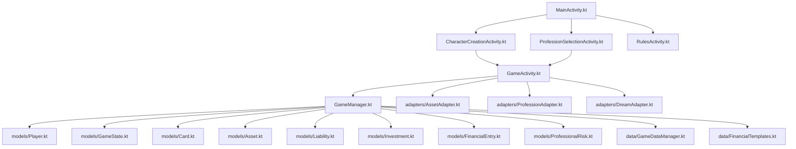
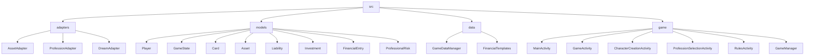

# Архитектура MoneyGame (C4 Model)

## 1. Контекст (Context)

**MoneyGame** — мобильное Android-приложение для обучения финансовой грамотности.

- Весь код относится к одному контейнеру: **Android-приложение MoneyGame**.

**Схема уровня Контекст:**

---

## 2. Контейнер (Container)

- **Android-приложение** (единственный контейнер).

**Схема уровня Контейнер:**

---

## 3. Компоненты (Components) и их классы

### 3.1. UI-компоненты (экраны, интерфейс)
- MainActivity — главный экран
- GameActivity — основной игровой процесс
- CharacterCreationActivity — расширенное создание персонажа
- ProfessionSelectionActivity — выбор профессии и мечты
- RulesActivity — экран с правилами
- **Adapters** (отображение списков):
  - adapters/AssetAdapter.kt
  - adapters/ProfessionAdapter.kt
  - adapters/DreamAdapter.kt
  - (и другие в adapters/)

**Схема UI-компонента:**

### 3.2. Компонент бизнес-логики
- GameManager — управление состоянием игры

**Схема компонента бизнес-логики:**

### 3.3. Компонент моделей (структура данных)
- models/Player.kt — игрок
- models/GameState.kt — состояние игры
- models/Card.kt — карточки, профессии, мечты, активы, пассивы, инвестиции
- models/Asset.kt, models/Liability.kt, models/Investment.kt — отдельные сущности
- models/FinancialEntry.kt — финансовый журнал
- models/ProfessionalRisk.kt — профессиональные риски
- (и другие в models/)

**Схема компонента моделей:**

### 3.4. Компонент данных
- data/GameDataManager.kt — статические игровые данные
- data/FinancialTemplates.kt — шаблоны финансовых профилей

**Схема компонента данных:**

**Общая схема уровня Компоненты (для контекста):**

---

## 4. Код (Code) — детализация по файлам

### UI (экраны и адаптеры)
- MainActivity.kt — главный экран, навигация
- GameActivity.kt — игровой процесс, обработка событий, обновление UI
- CharacterCreationActivity.kt — создание персонажа
- ProfessionSelectionActivity.kt — выбор профессии/мечты
- RulesActivity.kt — правила игры
- adapters/AssetAdapter.kt, adapters/ProfessionAdapter.kt, adapters/DreamAdapter.kt — списки в RecyclerView

### Логика и данные
- GameManager.kt — игровая логика, управление состоянием
- data/GameDataManager.kt — статические игровые данные
- data/FinancialTemplates.kt — шаблоны финансовых профилей

### Модели
- models/Player.kt — игрок
- models/GameState.kt — состояние игры
- models/Card.kt — карточки, профессии, мечты, активы, пассивы, инвестиции
- models/Asset.kt, models/Liability.kt, models/Investment.kt — отдельные сущности
- models/FinancialEntry.kt — финансовые операции, журнал
- models/ProfessionalRisk.kt — профессиональные риски
- (и другие в models/)

**Схема уровня Код:**

---

## Как определить принадлежность любого класса?

- **adapters/** — UI-компонент (адаптер для списков)
- **models/** — компонент моделей (структура данных, бизнес-логика)
- **data/** — компонент данных (статические/пользовательские данные, шаблоны)
- **корень game/ + Activity** — UI-компонент (экран)
- **GameManager.kt** — бизнес-логика (ядро игры)
- **GameDataManager.kt, FinancialTemplates.kt** — компонент данных

**Схема принадлежности по папкам:**

---

## Пример

- **app/src/main/java/com/financialsuccess/game/models/Player.kt**  
  → Компонент моделей, слой бизнес-логики, отвечает за структуру и методы игрока.
- **app/src/main/java/com/financialsuccess/game/adapters/AssetAdapter.kt**  
  → UI-компонент, отвечает за отображение списка активов.
- **app/src/main/java/com/financialsuccess/game/data/FinancialTemplates.kt**  
  → Компонент данных, отвечает за шаблоны финансовых профилей.

---

Если укажете конкретный класс — скажу его принадлежность и роль максимально подробно!
