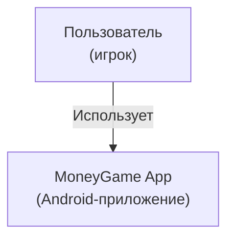
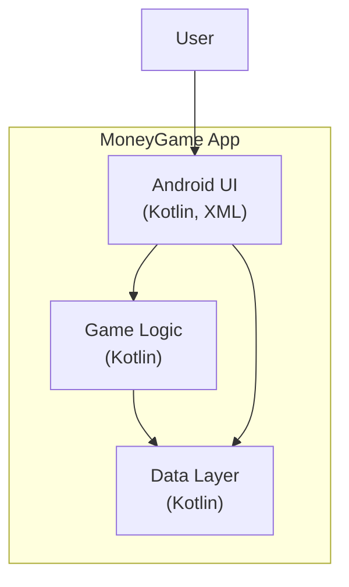
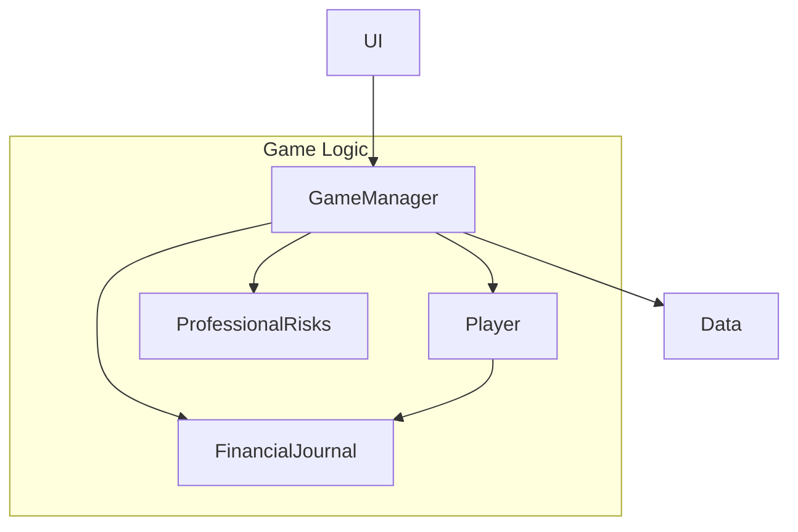

# Архитектура проекта MoneyGame (C4)

## 1. Контекст (System Context)

**Описание:**
- Пользователь взаимодействует с мобильным приложением MoneyGame для симуляции финансовой настольной игры.

---

## 2. Контейнеры (Container)

**Описание:**
- **Android UI** — визуальный интерфейс, обработка ввода пользователя, отображение состояния игры.
- **Game Logic** — бизнес-логика: обработка ходов, событий, расчётов, управление состоянием.
- **Data Layer** — хранение и загрузка данных (профессии, мечты, активы, риски).

---

## 3. Компоненты (Component, внутри Game Logic)

**Описание:**
- **GameManager** — управляет ходом игры, состоянием, переходами.
- **Player** — модель игрока: финансы, активы, профессия.
- **FinancialJournal** — журнал доходов/расходов, история операций.
- **ProfessionalRisks** — обработка профессиональных рисков.

---

## 4. Взаимодействие с ресурсами
- Графические и справочные материалы хранятся в папке `docs` (бывшие *.md, изображения, GIF).
- Все ресурсы, используемые в приложении, находятся в `app/src/main/res`.

---

## 5. Краткое резюме
- Приложение построено по принципу разделения UI, логики и данных.
- Вся бизнес-логика инкапсулирована в Kotlin-классах.
- Внешние документы и вспомогательные материалы вынесены в отдельную папку `docs`. 