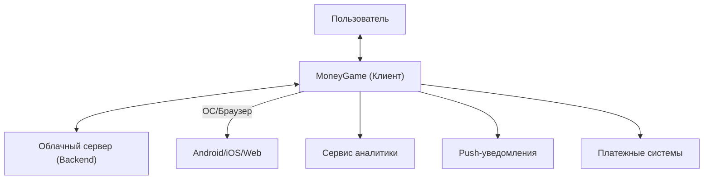
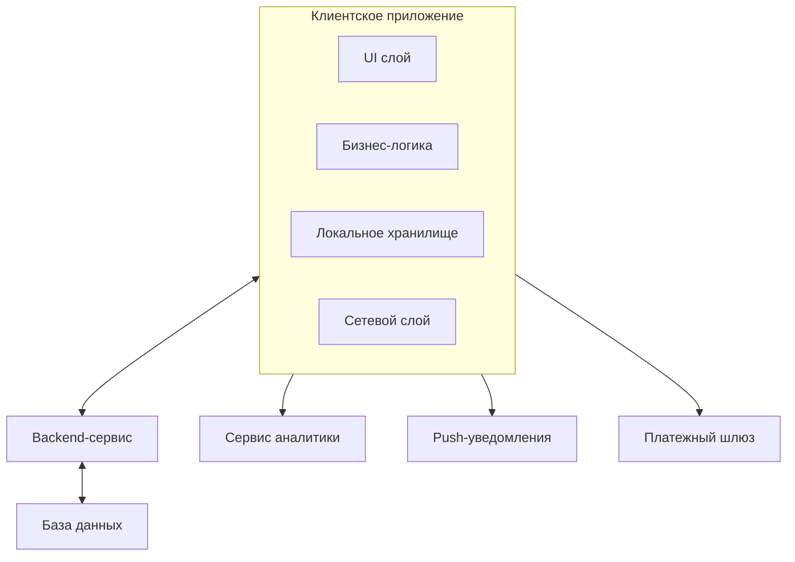
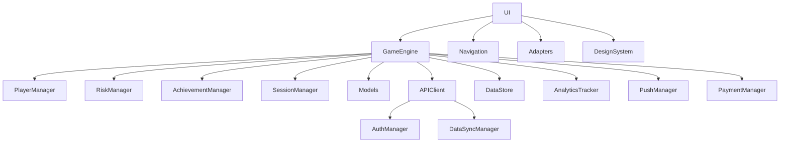
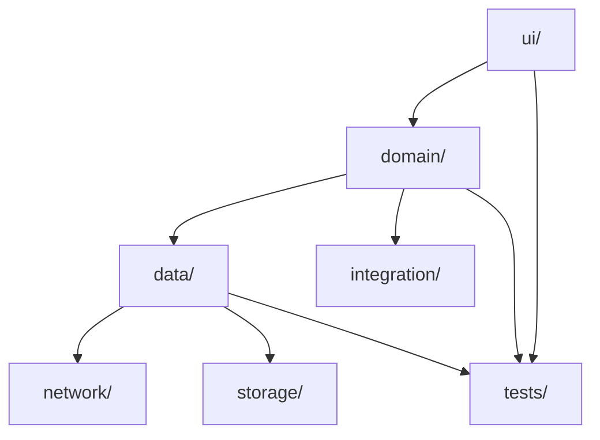
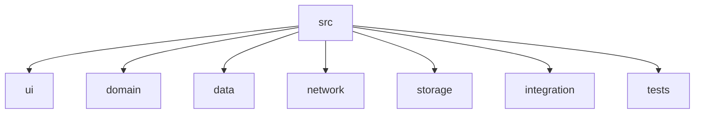

# Идеальная архитектура MoneyGame (C4 Model)

## 1. Контекст (Context)

**MoneyGame** — кроссплатформенное приложение для обучения финансовой грамотности, доступное на Android, iOS и Web.

- Пользователь взаимодействует с приложением через современный UI.
- Приложение интегрируется с облачным сервером для хранения прогресса, аналитики, мультиплеера, обновлений контента.
- Внешние системы: ОС (Android/iOS/Web), облачный backend, сервисы аналитики, push-уведомления, платежные системы.

**Схема уровня Контекст:**

---

## 2. Контейнеры (Containers)

- **Клиентское приложение** (Android/iOS/Web, общий слой бизнес-логики, UI, локальное хранилище)
- **Backend-сервис** (REST/gRPC API, хранение данных, мультиплеер, аналитика, обновления)
- **База данных** (PostgreSQL/NoSQL)
- **Сервис аналитики** (например, Firebase Analytics)
- **Push-уведомления** (Firebase/Apple/OneSignal)
- **Платежный шлюз** (для покупок внутри приложения)

**Схема уровня Контейнеры:**

---

## 3. Компоненты (Components)

### В клиентском приложении:
- **UI-компоненты:** Экраны, виджеты, адаптеры, дизайн-система, навигация.
- **Бизнес-логика:** GameEngine, PlayerManager, RiskManager, AchievementManager, SessionManager.
- **Сетевой слой:** APIClient, AuthManager, DataSyncManager.
- **Локальное хранилище:** DataStore, Preferences, OfflineCache.
- **Интеграции:** AnalyticsTracker, PushManager, PaymentManager.
- **Модели:** Player, GameState, Card, Asset, Transaction, Risk, Achievement и др.

### В backend:
- **API:** REST/gRPC endpoints (авторизация, прогресс, мультиплеер, лидерборды, обновления контента)
- **Game Logic Service:** Валидация ходов, расчёт результатов, обработка событий
- **User Service:** Профили, прогресс, настройки
- **Data Service:** Работа с БД
- **Analytics Service:** Сбор и агрегация событий
- **Notification Service:** Push-уведомления

**Схема уровня Компоненты (клиент):**

---

## 4. Код (Code)

### Принципы идеального слоя кода:
- **Чистая архитектура:** разделение на слои (Presentation, Domain, Data)
- **SOLID, DI, тестируемость**
- **Модули:**
  - `ui/` — экраны, компоненты, навигация
  - `domain/` — бизнес-логика, use-cases, интерфейсы
  - `data/` — репозитории, источники данных, модели хранения
  - `network/` — API-клиенты, DTO
  - `storage/` — локальное хранилище, кэш
  - `integration/` — аналитика, пуши, платежи
- **Тесты:** модульные, интеграционные, e2e
- **Документация и схемы**

**Схема слоя кода (клиент):**

---

## Кратко: идеальные принципы
- **Ясное разделение ответственности** (UI ≠ бизнес-логика ≠ данные)
- **Масштабируемость** (легко добавить мультиплеер, аналитику, новые платформы)
- **Тестируемость** (каждый слой покрыт тестами)
- **Интеграция с облаком** (прогресс, мультиплеер, обновления)
- **Безопасность и приватность**
- **Документированность** (архитектурные схемы, описание API, гайдлайны)

---

## Пример структуры каталогов (клиент)

---

**Эта архитектура позволяет легко развивать проект, внедрять новые фичи, поддерживать качество и масштабируемость.** 